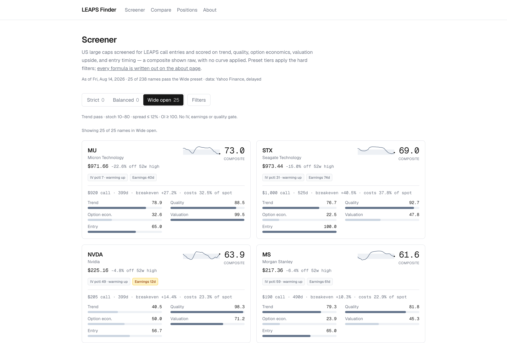
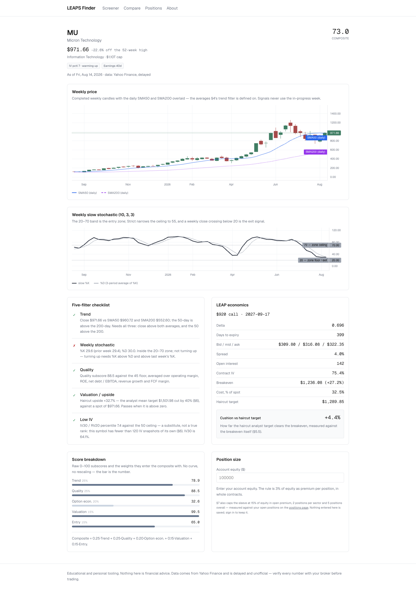
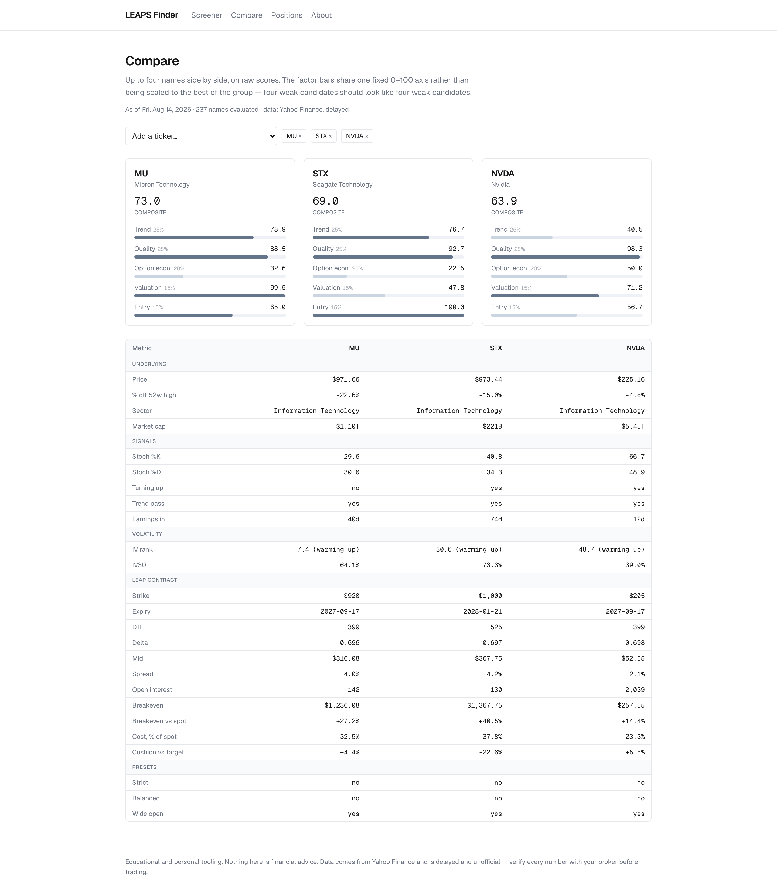

# LEAPS Finder

[](https://github.com/rajivjc/leaps-finder/actions/workflows/ci.yml)
[](https://github.com/rajivjc/leaps-finder/actions/workflows/scan-weekly.yml)
[](https://github.com/rajivjc/leaps-finder/actions/workflows/refresh-daily.yml)

A screener for long-dated call options (LEAPS) on US large caps. It applies five filters —
trend, weekly stochastic, quality, valuation upside, and low implied volatility — prices a
roughly one-year 0.70-delta call for every match, and ranks candidates with a composite score
that is displayed exactly as computed.

No curves, no rescaling, no green-at-70 thresholds. If a name scores 43, it shows 43.

> Educational and personal tooling on delayed, unofficial data. Nothing here is financial
> advice. See [SPEC.md](SPEC.md) for every formula and [/about](apps/web/app/about/page.tsx)
> for the caveats the app itself displays.

## Screens

Captured from the live app against a real weekly scan — 238 names in the universe, 237
evaluated, as of Friday 14 August 2026.

### Screener



The preset tabs report their own counts, and two of the three are showing zero. That is the real
result for this scan, not a loading state: 29 names clear trend plus zone plus turning-up, but
only 9 of them also clear Strict's and Balanced's `OI ≥ 200` liquidity gate, and the intersection
with the remaining gates is empty. Whether the preset thresholds are calibrated correctly is a
strategy question this repo deliberately leaves open — the screener's job is to report the
filters as specified, not to find something to show.

Every IV-rank badge reads *warming up* for the same honest reason: IV rank is computed from this
project's own `iv_snapshots`, and §6 requires 120 daily observations before the number means
anything. Until then the card says so and the score substitutes a cross-sectional percentile.

### Ticker detail



Weekly candles with the SMA50/200 overlay, the stochastic panel with its 20/70 band, the
five-filter checklist with a reason on every row, and the score breakdown showing raw factor
numbers. A composite of 73.0 is drawn as 73.0.

### Compare



Up to four names, opening on the top three. The factor bars share one fixed 0–100 axis rather
than being normalised to the best of the group, so three mediocre candidates look like three
mediocre candidates. Underneath, the numbers the scores were computed from — including the
`Strict / Balanced / Wide open` row that shows two of the three presets rejecting all of them.

## Architecture

```
GitHub Actions (cron)          Supabase Postgres            Vercel
┌────────────────────┐         ┌──────────────────┐         ┌──────────────────┐
│ scanner (Python)   │ service │ tickers          │  anon   │ Next.js App      │
│  universe          │  key    │ scans            │  key    │  / screener      │
│  prices/indicators │  write  │ scan_results     │  read   │  /t/[symbol]     │
│  fundamentals      ├────────▶│ weekly_bars      │◀────────┤  /compare        │
│  options + BS delta│         │ iv_snapshots     │         │  /positions      │
│  scoring           │         │                  │         │  /about          │
│  exit monitor      │         │ positions    RLS │         └──────────────────┘
│  daily marks       │         │ alerts       RLS │
└────────────────────┘         │ position_marks   │         server components,
                               │ user_settings    │         precomputed rows only
   weekly: full scan (Sat)     └──────────────────┘
   daily:  refresh + exits
```

Everything above the rule in that middle column is public: the scanner writes it with the service
key from Actions secrets, and anyone may read it. Nothing else can write it at all, which is
enforced by the absence of an insert policy rather than by trust.

Below the rule, ownership decides. The owner writes their own `positions` and `user_settings`
straight from the browser under `auth.uid() = user_id`; the scanner writes `alerts` and
`position_marks` on their behalf and the owner only reads them back — acknowledging an alert is
the single exception. The anon key the browser ships with is powerless outside those policies,
which is the whole reason the secret key never leaves Actions.

## Repo layout

| Path | What lives there |
|---|---|
| `apps/web/` | Next.js App Router frontend (Vercel root directory) |
| `scanner/` | Python package `leaps_scanner` — the whole pipeline |
| `supabase/migrations/` | Schema and RLS policies |
| `.github/workflows/` | CI, plus the weekly and daily scan crons |
| `docs/` | Supabase setup runbook, and the screenshots above |
| `SPEC.md` | Source of truth for every formula, threshold, and preset |

## Getting started

Requires Python 3.11+, Node 22+, and [uv](https://docs.astral.sh/uv/).

```bash
make setup
```

Then follow **[docs/SETUP.md](docs/SETUP.md)** to create a Supabase project, apply the
migrations, verify the security policies, and get the keys to the four places they belong. It
takes about fifteen minutes and covers what to do if a key ever leaks.

The short version: apply `supabase/migrations/` in order, then fill in the two env files.

```bash
cp scanner/.env.example scanner/.env        # SUPABASE_URL, SUPABASE_SERVICE_KEY
cp apps/web/.env.example apps/web/.env.local # NEXT_PUBLIC_* pair
```

Neither file is tracked. This repo is public — no key of any kind belongs in a commit, and the
service key belongs only in those two places and GitHub Actions secrets.

```bash
make web      # dev server on :3000
make scan     # the same full scan Actions runs on Saturdays
make lint     # ruff + eslint + tsc
make test     # pytest
```

Dev must be on port 3000. Sign-in links are built from the browser's own origin and Supabase
rejects any origin missing from its redirect allow-list, so a server on :3001 can read the
screener but cannot complete a magic link.

## Deploying

The web app deploys to Vercel from `apps/web`. There is deliberately no `vercel.json`: the only
setting this monorepo needs is the root directory, which is a project setting rather than a file,
and an otherwise-empty config committed next to it would just be a second place to look.

1. **New Project** → import this repository.
2. Set **Root Directory** to `apps/web`. Next.js, the build command, and the output directory are
   then detected automatically. Skipping this step is the one way to get a build that fails at
   "no framework detected".
3. Add the two public environment variables from [docs/SETUP.md §6](docs/SETUP.md) —
   `NEXT_PUBLIC_SUPABASE_URL` and `NEXT_PUBLIC_SUPABASE_ANON_KEY`. The publishable key only; the
   secret key never touches Vercel.
4. Add `https://<your-domain>/auth/callback` to Supabase's **Authentication → URL Configuration →
   Redirect URLs**, alongside the localhost entry. Until it is there, sign-in works locally and
   fails in production.

The build runs without Supabase configured — CI proves this on every pull request — so a missing
variable surfaces as an "unconfigured" notice on the page rather than a failed deploy. That is
friendlier to debug and also means the first deploy cannot fail for that reason alone.

## Operations

Two crons keep the data current, and both report through the badges at the top of this file.

| Workflow | When | What it does |
|---|---|---|
| **Weekly scan** | Saturdays 02:00 UTC | Full pipeline: universe, prices, fundamentals, chains, scoring, weekly exit rules |
| **Daily refresh** | Weekdays 22:30 UTC | Quotes, IV snapshots, and the daily exit rules; doubles as the Supabase keep-alive |

A run exits non-zero whenever its scan row is recorded as `failed`, so the badge going red is the
alerting mechanism — there is no inbox to check. A scan that loses more than a fifth of the
universe fails rather than publishing thinned-out results, and the screener will not display it.

The daily cron runs `1-5` rather than SPEC.md §9's literal `2-6`. At 22:30 UTC there is no date
rollover, so `2-6` would cover Tuesday through Friday's US closes plus a Saturday with no session
and miss Monday's entirely; `1-5` is what §9's own annotation ("Mon–Fri US close") describes. The
reasoning is repeated in the workflow file.

## How a scan decides

The scanner reads the bundled S&P 500 seed list, keeps names at $50B or more of market cap,
pulls two years of daily bars for each, and evaluates them at the close of the **last completed
week**. The in-progress week is dropped before any signal is computed, so a Tuesday rerun
reproduces Saturday's numbers exactly — nothing repaints.

A symbol without enough history to define every signal is excluded rather than approximated,
and a 10-week window with no range yields no stochastic rather than an invented midpoint. If
more than 20% of the universe ends up missing for any reason, the scan is recorded as `failed`
and the screener will not display it. Partial data never looks complete.

## Status

Built milestone by milestone against [SPEC.md §11](SPEC.md).

- [x] **M1 Scaffold** — monorepo, migrations + RLS, Next.js shell with Supabase client, CI
- [x] **M2 Scanner core** — universe, prices, indicators, `scan_results` writes, weekly cron
- [x] **M3 Options + scoring** — chain selection, Black-Scholes delta, IV snapshots, presets
- [x] **M4 Frontend** — screener, ticker detail, compare, about; `weekly_bars` chart series
- [x] **M5 Risk** — magic-link auth, positions CRUD, persisted size calculator, §7's exit
      monitor and alerts, daily refresh job
- [x] **M6 Polish** — screenshots, scan and refresh badges, deploy runbook, disclaimer audit

That is v1. [SPEC.md §12](SPEC.md) parks the rest: a backtest of the stock-level signal, email
alerts through Resend, and IV-rank graduation once 252 snapshots have accumulated — roughly a
year of the daily refresh, with the *warming up* badges clearing at 120 around six months in.

## Disclaimer

This project is educational. Yahoo Finance data is delayed and unofficial. Long-dated calls
regularly expire worthless and you can lose the entire premium. Nothing in this repository or
the application it builds constitutes financial advice. Do your own research.
