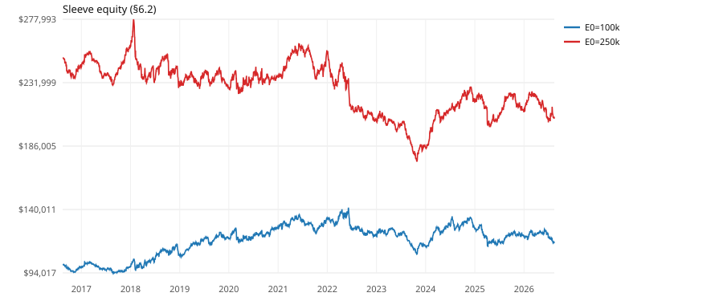
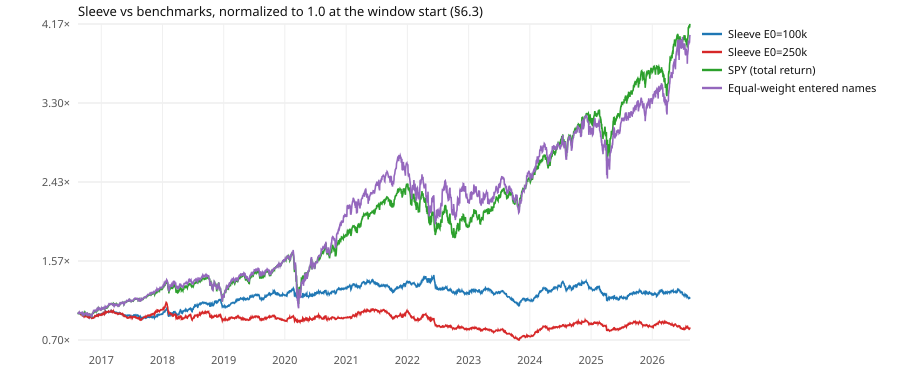

# LEAPS Finder backtest — 2026-08-16

Evaluation window **2016-08-14 → 2026-08-14** (data fetched from 2015-02-11 for warm-up). Cache snapshot: 2026-08-16. Run status: **ok**.

## What this backtest can and cannot claim

**It evaluates:** the §4 timing signal — daily trend template plus weekly slow stochastic —
as an entry/exit discipline on S&P 500 members, and approximately what that timing is worth
when expressed through a ~1-year 0.70Δ call under stated assumptions.

**It does not evaluate:**
- the quality, valuation, IV-rank, or earnings-distance filters (no point-in-time data);
- the preset liquidity gates (spread %, OI — no historical chains);
- the live screener's ranking/score (§6 needs fundamentals);
- real option fills, IV dynamics, or early-exercise/assignment effects.

Therefore: **a good backtest result validates the timing component only.** It is evidence
about two of the five filters. The live strategy could still underperform (bad fundamental
filters, unmodeled IV crush) or outperform (the untested filters may add value).

---

## Headline

- **Stock signal (base):** 5,942 trades over 569 names, win rate 36.3%, mean +2.24%, median -2.51%, profit factor 1.58.
- **Through the synthetic LEAP (base, m = 1.1, h = 0.04):** 5,952 trades, win rate 26.4%, mean -2.26%, median -21.34%, profit factor 0.89. Mean vehicle alpha -4.51% — what the option cost or added against simply owning the shares over the same window.
- **The vehicle does not survive the pinned friction: the signal's edge on the shares is negative through the option.**
- **Sleeve E0=100k:** +15.53% total (+1.45% CAGR), max drawdown 23.91%, 231 positions funded of 5,952 available signals.
- **Sleeve E0=250k:** -17.61% total (-1.92% CAGR), max drawdown 37.00%, 250 positions funded of 5,952 available signals.
- **SPY buy-and-hold (total return) over the same window:** +315.99% total (+15.32% CAGR), max drawdown 33.72%. See §5's exposure caveat before reading that as like-for-like.
- **Read the sleeve carefully.** The two starting equities share only 139 of their 231 / 250 funded positions. With five slots against thousands of signals, *which* trades get funded is decided mostly by arrival order and the P10 tie-break, so the sleeve's headline figure carries far more sampling noise than Track A's and should not be read as a second estimate of the signal's edge.

---

## 1. Coverage (§2.4)

| Metric | Value |
|---|---|
| Member-weeks covered | 243,373 |
| Member-weeks total | 262,543 |
| Coverage ratio | 92.70% |
| Point-in-time members | 711 |
| Members with no data at all | 87 |
| Symbols with incomplete coverage | 100 |

Auxiliary series: `SPY` cached, `^IRX` cached.

---

## 2. Track A — per-trade (§6.1)

Every §4.2 signal counted independently (P8: one open trade per name per track). This is the primary result; the sleeve below is secondary.

### Stock track

| Variant | Trades | Names | Win rate | Mean | Median | Profit factor | p5 | p95 | Market delta |
|---|---|---|---|---|---|---|---|---|---|
| base | 5942 | 569 | 36.3% | +2.24% | -2.51% | 1.58 | -12.46% | +32.47% | -0.45% |
| strict | 4408 | 568 | 35.9% | +1.98% | -2.44% | 1.53 | -12.05% | +30.56% | -0.46% |

### LEAP overlay

An approximation layer, not the live screener: a synthesized 0.70Δ strike, no liquidity gates, flat IV. `base` is the headline configuration (m = 1.1, h = 0.04); the rest are §5.6's sensitivities.

| Variant | Trades | Names | Win rate | Mean | Median | Profit factor | p5 | p95 | Market delta |
|---|---|---|---|---|---|---|---|---|---|
| base | 5952 | 569 | 26.4% | -2.26% | -21.34% | 0.89 | -50.96% | +118.74% | -4.96% |
| m1.0 | 5963 | 569 | 27.0% | -0.85% | -22.10% | 0.96 | -53.09% | +132.01% | -3.53% |
| m1.2 | 5948 | 569 | 25.7% | -3.50% | -20.72% | 0.83 | -48.68% | +107.62% | -6.19% |
| h0.00 | 5949 | 569 | 31.2% | +5.87% | -14.74% | 1.35 | -46.87% | +136.99% | +3.18% |
| h0.06 | 5955 | 569 | 24.8% | -6.11% | -24.45% | 0.74 | -52.82% | +110.12% | -8.80% |
| strict | 4412 | 568 | 25.5% | -2.63% | -20.61% | 0.87 | -49.43% | +115.85% | -5.07% |

### Exit reasons

**Stock track (base):**

| Exit reason | Trades | Share |
|---|---|---|
| trend_break | 3906 | 65.7% |
| time_exit | 1107 | 18.6% |
| stoch_below_20 | 762 | 12.8% |
| end_of_window | 165 | 2.8% |
| delisted | 2 | 0.0% |

**LEAP overlay (base):**

| Exit reason | Trades | Share |
|---|---|---|
| trend_break | 3862 | 64.9% |
| time_exit | 1106 | 18.6% |
| stoch_below_20 | 740 | 12.4% |
| end_of_window | 164 | 2.8% |
| premium_stop | 78 | 1.3% |
| delisted | 2 | 0.0% |

---

## 3. Sensitivity grid (§5.6)

One parameter moved at a time around the base case. The §4 signals and the stock track are computed once and shared across all six replays (§5.6's scope rule), so every row differs only in the vehicle.

| Config | Zone | m | h | Trades | Win rate | Mean | Median | PF | Vehicle alpha |
|---|---|---|---|---|---|---|---|---|---|
| base | base | 1.10 | 0.04 | 5952 | 26.4% | -2.26% | -21.34% | 0.89 | -4.51% |
| m1.0 | base | 1.00 | 0.04 | 5963 | 27.0% | -0.85% | -22.10% | 0.96 | -3.09% |
| m1.2 | base | 1.20 | 0.04 | 5948 | 25.7% | -3.50% | -20.72% | 0.83 | -5.75% |
| h0.00 | base | 1.10 | 0.00 | 5949 | 31.2% | +5.87% | -14.74% | 1.35 | +3.62% |
| h0.06 | base | 1.10 | 0.06 | 5955 | 24.8% | -6.11% | -24.45% | 0.74 | -8.36% |
| strict | strict | 1.10 | 0.04 | 4412 | 25.5% | -2.63% | -20.61% | 0.87 | -4.62% |

---

## 4. Track B — sleeve simulation (§6.2)

SPEC.md §7's discipline applied to the overlay's base-configuration signals: 3% premium budget per position, integer contracts, at most 5 open and 2 per sector, open premium at cost capped at 15% of equity, cash at 0%, and the 8% circuit breaker enforced as a hard 28-day entry ban (§6.2's stated hardening of v1's advisory banner). Positions are a strict subset of the overlay track's trades: the sleeve chooses which signals to fund, and each funded position runs to that trade's own exit.

Sector labels cover 503 of the window's 711 point-in-time members; **93 of the names that actually traded have no label** and share a single `Unknown` bucket, so the 2-per-sector cap binds across unrelated companies among them. That tightens the sleeve rather than loosening it (bias register row 7).

### E0=100k

| Metric | Value |
|---|---|
| Start equity | $100,000.00 |
| Final equity | $115,534.57 |
| Total return | +15.53% |
| CAGR | +1.45% |
| Max drawdown (daily equity) | 23.91% on 2023-10-27 |
| Positions funded | 231 |
| Distinct names | 180 |
| Win rate | 25.1% |
| Average open positions | 4.71 |
| Average premium exposure | 11.47% |
| Circuit-breaker activations | 0 |

**Entries declined** (5,721 of 5,952 available signals):

| Cause | Count | Share of declines |
|---|---|---|
| sleeve_breaker | 0 | 0.0% |
| sleeve_slots | 5,623 | 98.3% |
| sleeve_sector | 16 | 0.3% |
| sleeve_granularity | 82 | 1.4% |
| sleeve_exposure | 0 | 0.0% |

**Calendar-year returns** (the first and last years are partial — the window starts and ends mid-year, and a stub year is reported as it happened rather than annualized):

| Year | Return |
|---|---|
| 2016 | -2.38% |
| 2017 | +0.67% |
| 2018 | +9.01% |
| 2019 | +11.49% |
| 2020 | +6.55% |
| 2021 | +5.32% |
| 2022 | -9.22% |
| 2023 | -6.47% |
| 2024 | +11.14% |
| 2025 | -5.14% |
| 2026 | -3.70% |

### E0=250k

| Metric | Value |
|---|---|
| Start equity | $250,000.00 |
| Final equity | $205,968.61 |
| Total return | -17.61% |
| CAGR | -1.92% |
| Max drawdown (daily equity) | 37.00% on 2023-10-27 |
| Positions funded | 250 |
| Distinct names | 191 |
| Win rate | 22.8% |
| Average open positions | 4.69 |
| Average premium exposure | 11.94% |
| Circuit-breaker activations | 0 |

**Entries declined** (5,702 of 5,952 available signals):

| Cause | Count | Share of declines |
|---|---|---|
| sleeve_breaker | 0 | 0.0% |
| sleeve_slots | 5,662 | 99.3% |
| sleeve_sector | 20 | 0.4% |
| sleeve_granularity | 20 | 0.4% |
| sleeve_exposure | 0 | 0.0% |

**Calendar-year returns** (the first and last years are partial — the window starts and ends mid-year, and a stub year is reported as it happened rather than annualized):

| Year | Return |
|---|---|
| 2016 | -2.88% |
| 2017 | +6.09% |
| 2018 | -10.08% |
| 2019 | -1.16% |
| 2020 | +3.40% |
| 2021 | +7.70% |
| 2022 | -19.35% |
| 2023 | -9.60% |
| 2024 | +17.27% |
| 2025 | -3.38% |
| 2026 | -2.20% |

---

## 5. Benchmarks (§6.3)

| Benchmark | Total return | CAGR | Max drawdown | Constituents |
|---|---|---|---|---|
| SPY buy-and-hold (total return) | +315.99% | +15.32% | 33.72% on 2020-03-23 | — |
| Equal-weight buy-and-hold of entered names (full window) | +304.88% | +15.01% | 37.60% on 2020-03-23 | 569 |

> **Not like-for-like: the sleeve holds at most 15% of equity in premium by design (SPEC.md §7) and the rest in cash at 0%, while SPY is 100% invested throughout. Compare the shapes, not the headline CAGRs.**

The equal-weight benchmark holds the distinct entered names over the **full** evaluation window — each bought at its first eligible session (§3.1's warm-up rule) and held to the end, a delisted name holding its last close and then sitting in cash. It is deliberately not a same-trade-window hold: that quantity is arithmetically the stock track itself, which is why §0's Decision 7 was amended in review.





---

## 6. Bias register (§7)

Every approximation in this backtest, with the direction it is expected to push the result. Nothing here is a caveat added after the fact — the register is part of the spec and travels with every run.

| # | Assumption | Direction | Mitigation / note |
|---|---|---|---|
| 1 | Residual survivorship: delisted members with no yfinance data are unpriceable | Flatters (missing names skew toward failures) | Coverage ratio and the uncovered list are reported in full (§2.4) |
| 2 | Flat IV over each trade | Likely flatters (entries follow pullbacks, when true IV is typically elevated) | Stated; sensitivity on σ level only — path dynamics are out of scope |
| 3 | σ = 1.1 × RV252 | Unknown | Sensitivity at m ∈ {1.0, 1.2} (§5.6) |
| 4 | No liquidity gates; fills at model value ± h | Flatters (some trades untradeable at modeled prices) | h haircut plus sensitivity at h ∈ {0.00, 0.06}; non-comparability banner |
| 5 | Continuous strike (no grid) | Neutral/minor | — |
| 6 | r and q flat per trade | Minor | — |
| 7 | Current sector labels applied historically, and 208 of 711 point-in-time members have none | Minor; the unlabelled bucket tightens rather than loosens the cap | Affects only the 2-per-sector cap. §3.6's source covers current members only; RC's call (2026-08-16) buckets unlabelled names as `Unknown`, so the cap binds across unrelated companies — conservative by construction. The count of unlabelled names that actually traded is reported with the sleeve |
| 8 | Membership CSV errors possible | Unknown | Source and retrieval date recorded in the CSV header |
| 8a | Rename effective dates and price aliases (§2.3a) are hand-sourced | Unknown — a wrong alias splices two securities into one series | Each pair carries its source in the compiler; alias is span-scoped and unit-tested |
| 9 | Earnings-distance gate not simulated | Unknown (the backtest enters where live Strict/Balanced would wait) | Stated |
| 10 | Stock-track returns exclude dividends | Hurts the stock track slightly vs. total-return intuition | The vehicle is a call; benchmarks are labeled with their basis |
| 11 | Cash earns 0% in the sleeve | Hurts the sleeve | Conservative by construction |
| 12 | Quality/valuation/IV filters untested | Unknown — the live strategy may differ in either direction | §1 banner (§8's `banner` field) |

---

## Reproducing this run

```bash
python -m leaps_scanner.backtest --run-date 2026-08-16 --report-dir docs/backtest
```

Runs are deterministic from a given cache (acceptance 1). The price cache itself is git-ignored — raw Yahoo data is never committed — so a fresh machine re-fetches before it can reproduce these figures, and a later snapshot may differ where Yahoo has revised its history.

---

*Educational/personal tooling on delayed, unofficial data. This is a simulation built on the stated approximations above. Past performance — simulated or otherwise — does not predict future results. **Nothing here is financial advice.***
